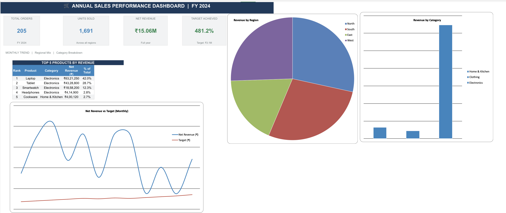

# 📊 FY 2024 Sales Performance Dashboard

## 🎯 Objective
Analyse 12 months of sales data across 4 regions, 3 product categories,
and 8 salespersons to track revenue, identify trends, and measure 
performance against monthly targets.

## 🛠️ Tools Used
- Microsoft Excel
  - Pivot-ready data structure
  - Formulas: SUM, IF, AVERAGE, VLOOKUP
  - Charts: Line, Bar, Pie
  - Conditional formatting & color scales
  - Auto-filter on raw data

## 📁 File Structure
| File | Description |
|---|---|
| `Sales_Dashboard_2024-2.xlsx` | Main Excel workbook with 5 sheets |
| `Dashboard-preview.png` | Screenshot of the dashboard |
\
## 📋 Sheets Explained
| Sheet | What it contains |
|---|---|
| 📊 Dashboard | KPI cards, 3 charts, top 5 products |
| 📋 Monthly Summary | 12-month revenue vs target with status |
| 🗺️ Region & Product | Breakdown by region and category |
| 🗃️ Raw Data | 200+ transaction rows with auto-filter |
| 📖 README | Project overview inside the file |

## 📸 Dashboard Preview

## 💡 Key Insights
- Electronics was the highest-revenue category
- Q4 (Oct–Dec) drove the strongest revenue performance
- All regions tracked against monthly targets with ✅ / ⚠️ status flags
- Top 5 products identified by total net revenue contribution

## 👤 Author
**SANTHOSH KOTHAKONDA** | B.Tech AI & ML | Aspiring Data Analyst
🔗 [LinkedIn](https://www.linkedin.com/in/santhosh-kothakonda)
